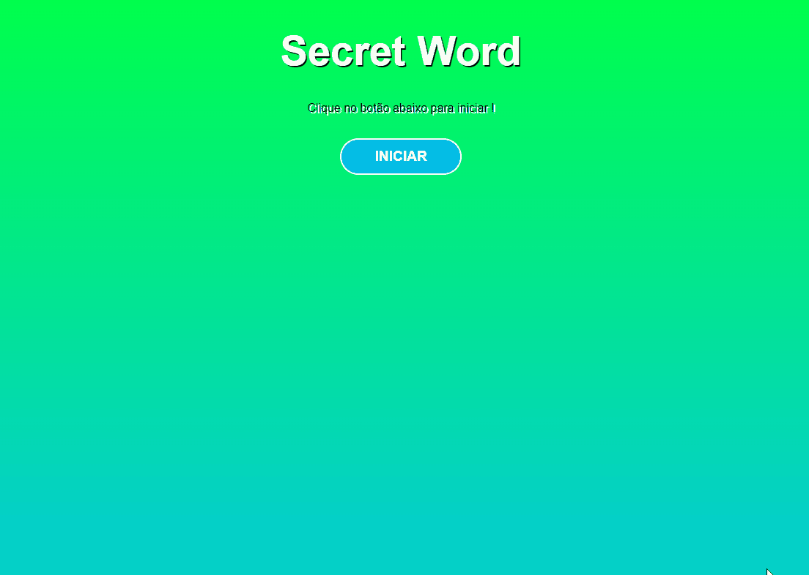

## Secret Word
<hr>

<h2>🕹️Jogo similar ao jogo da forca</h2>

Meu primeiro projeto em React.JS, trabalhando com os hook's useState, useEffect e useCallback, pude compreender melhor o gerenciamento de estados entre componentes na prática.
O jogo conta com algumas categorias de palavras, como fruta, parte do corpo, marcas de carro, partes de computador, programação, entre outros tipos. O usuário tem 4 chances de acertar uma letra, e uma nova palavra é gerada a cada vitória, no final é apresentado a pontualção acumulada.

<h2>⚙️Prévia de funcionamento</h2>

<br>
🔗[Clique aqui para jogar!](https://secret-word-gray-nine.vercel.app/)

## 👨🏻‍💻Descrição do código
- Detalhamento código do componente principal do projeto, para facilitar o entendimento do código, segue a descrição.
    
    ### **Imports**
    
    ```jsx
     
    import "./App.css";
    import { useCallback, useEffect, useState } from "react";
    import { wordsList } from "./data/words";
    import StartScreen from "./components/StartScreen";
    import Game from "./components/Game";
    import End from "./components/End";
    
    ```
    
    O código começa importando os recursos necessários para a aplicação, incluindo o CSS, as bibliotecas React, os dados do jogo (palavras e categorias), e os componentes.
    
    ### **Variáveis e Constantes**
    
    ```jsx
     
    const stages = [
      { id: 1, name: "start" },
      { id: 2, name: "game" },
      { id: 3, name: "end" },
    ];
    
    const guessesQty = 4; 
    
    ```
    
    Essas são constantes usadas em toda a aplicação. **`stages`** contém as etapas do jogo (início, jogo e fim) e **`guessesQty`** contém a quantidade de tentativas permitidas.
    
    ### **Estados**
    
    ```jsx
     
    const [gameStage, setGameStage] = useState(stages[0].name);
    const [words] = useState(wordsList);
    
    const [pickedWord, setPickedWord] = useState("");
    const [pickedCategory, setPictureCategory] = useState("");
    const [letters, setLetters] = useState([]);
    
    const [guessedLetters, setGuessedLetters] = useState([]);
    const [wrongLetters, setWrongLetters] = useState([]);
    const [guesses, setGuesses] = useState(guessesQty);
    const [score, setScore] = useState(0);
    
    ```
    
    Essas são as variáveis de estado usadas na aplicação. Cada variável de estado é definida usando o hook **`useState`**, que retorna uma dupla de valor e função para atualizar esse valor. Cada estado é usado para armazenar informações diferentes: 
    <ul>
    <li>stages é uma constante que armazena um array de objetos com as etapas do jogo: start, game e end.</li>
    <li>guessesQty é a quantidade de chances que o jogador terá para adivinhar a palavra.</li>
    <li>gameStage é o estado que armazena a etapa atual do jogo.</li>
    <li>words é o estado que armazena a lista de palavras que serão utilizadas no jogo.</li>
    <li>pickedWord é a palavra escolhida aleatoriamente pela aplicação.</li>
    <li>pickedCategory é a categoria da palavra escolhida.</li>
    <li>letters é um array com as letras da palavra escolhida.</li>
    <li>guessedLetters é um array com as letras que foram adivinhadas corretamente pelo jogador.</li>
    <li>wrongLetters é um array com as letras que não fazem parte da palavra, colocadas pelo jogador.</li>
    <li>guesses é a quantidade de chances restantes que o jogador tem, optei por 4 inicialmente.</li>
    <li>score é a pontuação do jogador.</li>
    </ul>
    
    ### **Funções**
    
    ```jsx
     
    const pickWordAndCategory = useCallback(() => {
      const categories = Object.keys(words);
      const category =
        categories[Math.floor(Math.random() * Object.keys(categories).length)];
      const word =
        words[category][Math.floor(Math.random() * words[category].length)];
      return { word, category };
    }, [words]);
    
    const startGame = useCallback(() => {
      clearLetterStates();
      const { category, word } = pickWordAndCategory();
      let wordLetters = word.split("");
      wordLetters = wordLetters.map((l) => l.toLowerCase());
      setPickedWord(word);
      setPictureCategory(category);
      setLetters(wordLetters);
      setGameStage(stages[1].name);
    }, [pickWordAndCategory]);
    
    const verifyLetter = (letter) => {
      const normalizedLetter = letter.toLowerCase();
      if (
        guessedLetters.includes(normalizedLetter) ||
        wrongLetters.includes(normalizedLetter)
      ) {
        return;
      }
      if (letters.includes(normalizedLetter)) {
        setGuessedLetters((actualGuessedLetters) => [
          ...actualGuessedLetters,
          normalizedLetter,
        ]);
      } else {
        setWrongLetters((actualWrongLetters) => [
          ...actualWrongLetters,
          normalizedLetter,
        ]);
        setGuesses((actualGuesses) => actualGuesses - 1);
    
    ```
    <h3>Detalhamento das funções</h3>
    <ul>
   <li> pickWordAndCategory(): Essa função é responsável por selecionar aleatoriamente uma categoria e uma palavra da lista de palavras disponíveis. É usada para iniciar um novo jogo.</li>

   <li> startGame(): Essa função é chamada quando o jogador clica no botão de iniciar o jogo. Ela chama a função pickWordAndCategory() para escolher uma palavra e uma categoria aleatórias, transforma a palavra em uma lista de letras, atualiza os estados do jogo e muda a etapa do jogo para "game".</li>

    <li>verifyLetter(letter): Essa função é chamada quando o jogador digita uma letra no input de letras. Ela verifica se a letra já foi usada antes (tanto nas letras certas quanto nas erradas), e caso contrário, verifica se a letra faz parte da palavra escolhida. Se a letra faz parte da palavra, ela é adicionada ao estado guessedLetters. Caso contrário, é adicionada ao estado wrongLetters e o número de tentativas restantes é decrementado em 1.</li>

    <li>clearLetterStates(): Essa função é chamada quando um novo jogo é iniciado, e é responsável por limpar os estados guessedLetters e wrongLetters.</li>

    <li>useEffect(): Essa é uma função do React que é usada para executar algum código quando um determinado estado muda. O código dentro dela será executado sempre que o valor de alguma das variáveis passadas como segundo argumento mudar. No código apresentado, há duas chamadas a useEffect:

    A primeira é responsável por verificar se o número de tentativas restantes chegou a zero, e se sim, mudar a etapa do jogo para "end".
    A segunda é responsável por verificar se o jogador adivinhou todas as letras da palavra escolhida, e se sim, adicionar 100 pontos à pontuação e iniciar um novo jogo.
    retry(): Essa função é chamada quando o jogador clica no botão de "jogar novamente" na tela de fim de jogo. Ela zera a pontuação e as tentativas restantes, e muda a etapa do jogo para "start".</li>
    </ul>
- 
    

## 🛠️Tecnologias

* HTML
* CSS
* JavaScript
* React
* NPM
* Visual Studio Code

## 📞 Contato

📩E-mail: pedrohgs2004@gmail.com <br>
🌐Linkedin: https://www.linkedin.com/in/pedro-henrique-g-silva-a2100a23a/?originalSubdomain=br
